# Business Process Accelerator


## Overview

[Azure Static Web Apps](https://docs.microsoft.com/azure/static-web-apps/overview) allows you to easily build [React](https://reactjs.org/) apps in minutes. Use this repo with the [React quickstart](https://docs.microsoft.com/azure/static-web-apps/getting-started?tabs=react) to build and customize a new static site and automate the deployment of a functional, and customizable, POC for text and language processing. 

This repo will create, and manage, a set of cognitive services and app resources, and most of the individual resource crendentials in your newly created Resource Group. And provide a React UI for uploading documents, creating language and audio pipelines using a variety of user-specified Azure Cogntive Services, and exporting the results. 

The following guide will present a high-level overview of the deployment architecture, with step-by-step instructions for immediate deployment, with several simple command-line steps.


- [Overview](#overview)  
- [Architecture](#architecture)  
- [Currently Inluded Algorithms](#currently-included-algorithms)  
- [Prerequisities](#prerequisities)  
- [Installation Steps](#installation-steps)  
  - [Create a Resource Group](#create-a-resource-group-in-your-azure-portal)
  - [Fork the Repo](#fork-the-repo)
  - [Create AND save personal access token](#create-and-save-personal-access-token)
  - [Navigate to and open for editing, business-process-automation/templates/templates.json in your local directory](#navigate-to-and-open-for-editing,-easybutton/templates/templates.json-in-your-local-directory)
  - [Clone your repo locally](#5-clone-your-repo-locally)
  - [Run initial deployment configuration](#run-initial-deployment-configuration)
  - [Create action to deploy](7-create-action-to-deploy)
  - [Launch App](#8-launch-app)
  - [Load Documents!](#load-documents)
- [Contacts](#contacts)  
- [Roadmap](#roadmap)
- [References](#references)  
---


## Architecture
Once you've created a high-level Resource Group, you'll fork this repository and importing helper libraries, taking advantage of Github Actions to deploy the set of Azure Cognitive Services and manage all of the new Azure module credentials, in the background, within your newly created pipeline. Once the pipeline is deployed, a static webapp will be created with your newly customizable POC UI for document processing!


## Currently Included Algorithms
The initial release includes Cognitive Services provided by Azure Language Service and Form Recognizer, such as text classification and custom named entity recognition, as well as standardized interface for deploying State-of-the-Art Hugging Face models. Additional tasks and models are on the roadmap for inclusion (see Roadmap section later in this document).
#### Form Recognizer Models  

| Model | Description |
| ----- | ----------- |
|Read (preview)	| Extract printed and handwritten text lines, words, locations, and detected languages. |
| General document (preview) |	Extract text, tables, structure, key-value pairs, and named entities.|
| Layout |	Extract text and layout information from documents.|  

 Prebuilt  
| Model | Description |
| ----- | ----------- |
| W-2 (preview) |	Extract employee, employer, wage information, etc. from US W-2 forms.|
|Invoice	| Extract key information from English and Spanish invoices.|
|Receipt	| Extract key information from English receipts.|
|ID document	| Extract key information from US driver licenses and international passports.|
|Business card	| Extract key information from English business cards.|  

Custom
| Model | Description |
| ----- | ----------- |
| Custom |	Extract data from forms and documents specific to your business. Custom models are trained for your distinct data and use cases. |
| Composed |	Compose a collection of custom models and assign them to a single model built from your form types.|  

https://docs.microsoft.com/en-us/azure/applied-ai-services/form-recognizer/concept-model-overview
#### Language Service Models

| Model | Description |
| ----- | ----------- |
|Named Entity Recognition (NER)|	This pre-configured feature identifies entities in text across several pre-defined categories.|
|Personally Identifiable Information (PII) detection	|This pre-configured feature identifies entities in text across several pre-defined categories of sensitive |information, such as account information.|
|Key phrase extraction|	This pre-configured feature evaluates unstructured text, and for each input document, returns a list of key phrases and main points in the text.|
|Entity linking	|This pre-configured feature disambiguates the identity of an entity found in text and provides links to the entity on Wikipedia.|
|Text Analytics for health|	This pre-configured feature extracts information from unstructured medical texts, such as clinical notes and doctor's notes.|
|Custom NER|	Build an AI model to extract custom entity categories, using unstructured text that you provide.|
|Analyze sentiment and opinions|	This pre-configured feature provides sentiment labels (such as "negative", "neutral" and "positive") for sentences and documents. This feature can additionally provide granular information about the opinions related to words that appear in the text, such as the attributes of products or services.|
|Custom text classification (preview)	|Build an AI model to classify unstructured text into custom classes that you define.|
|Text Summarization (preview)	|This pre-configured feature extracts key sentences that collectively convey the essence of a document.|


https://docs.microsoft.com/en-us/azure/cognitive-services/language-service/overview


#### Hugging Face Implementation
Many of the pretrained models from the huggingface library can be used, depending on the task selected! Find more information at https://huggingface.co/models?pipeline_tag=text-classification&sort=downloads

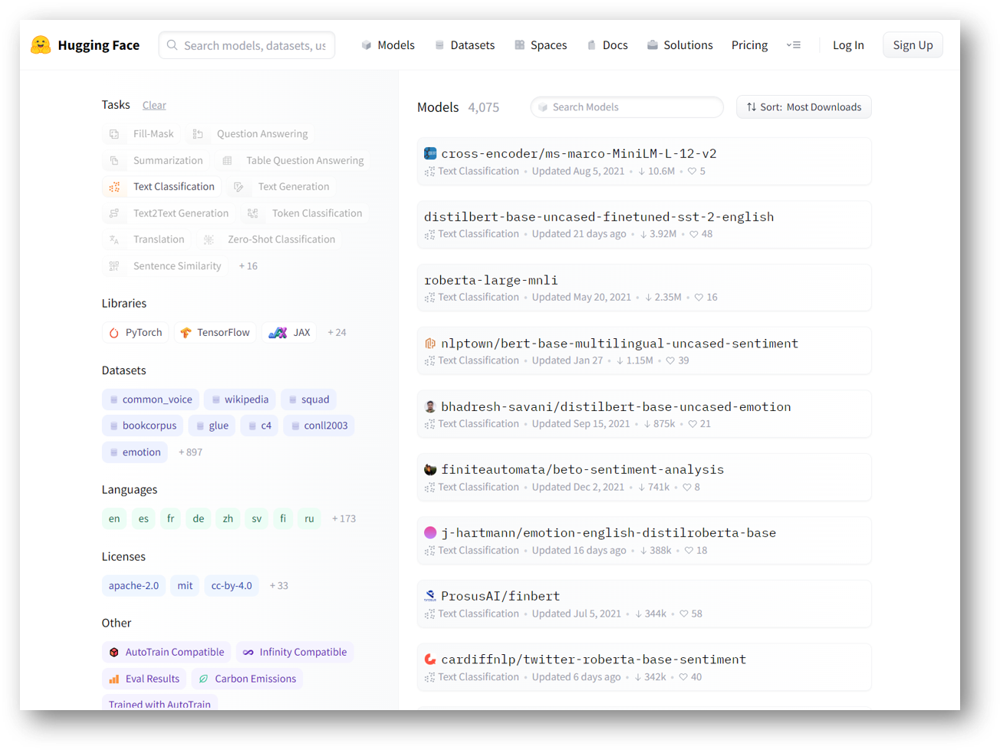  

## Prerequisities
1. Github account
2. Ensure your subscription has Microsoft.DocumentDB enabled  
To check:  
      - Go to your subscription within portal.azure.com  
      - Select Resource Providers at bottom of left navigation pane  
      - Within the Filter by name menu, search for Microsoft.DocumentDB  
      - Once Microsoft.DocumentDB is found, check if the status is marked as "Registered". If marked as "NotRegistered", Select "Register"  
      **Note**: *This process may take several seconds/minutes, be sure to refresh the entire browser periodically*
3. Ensure that you have accepted terms and conditions for Responsible AI  
"You must create your first Face, Language service, or Computer Vision resources from the Azure portal to review and acknowledge the terms and conditions. You can do so here: Face, Language service, Computer Vision. After that, you can create subsequent resources using any deployment tool (SDK, CLI, or ARM template, etc) under the same Azure subscription."

## Installation Steps

## 1. Create a Resource Group in your Azure Portal
Create your Resource group.
Select your preferred Region
  
https://docs.microsoft.com/en-us/azure/azure-resource-manager/management/manage-resource-groups-portal  

It will take a few seconds for your Resource Group to be created.
  
For more help, refer to https://docs.microsoft.com/en-us/azure/azure-resource-manager/management/manage-resource-groups-portal  

## 2. Fork the repo
Fork https://github.com/Azure/business-process-automation to your github account. For basic instructions please refer to https://docs.microsoft.com/en-us/azure/devops/repos/git/forks?view=azure-devops&tabs=visual-studio  
**Note**: *a Microsoft organization github account is **not** required*  

## 3. Create AND save personal access token
1.  On your github repo page, click your profile  
2.  Select Settings (under your profile icon in the top right)  
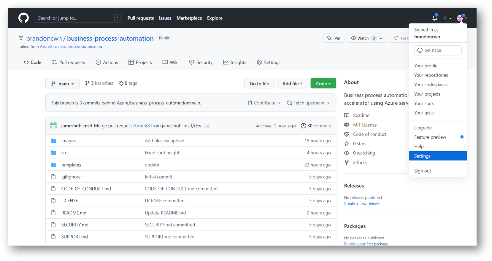  
3. Select Developer settings at bottom of left navigation pane  
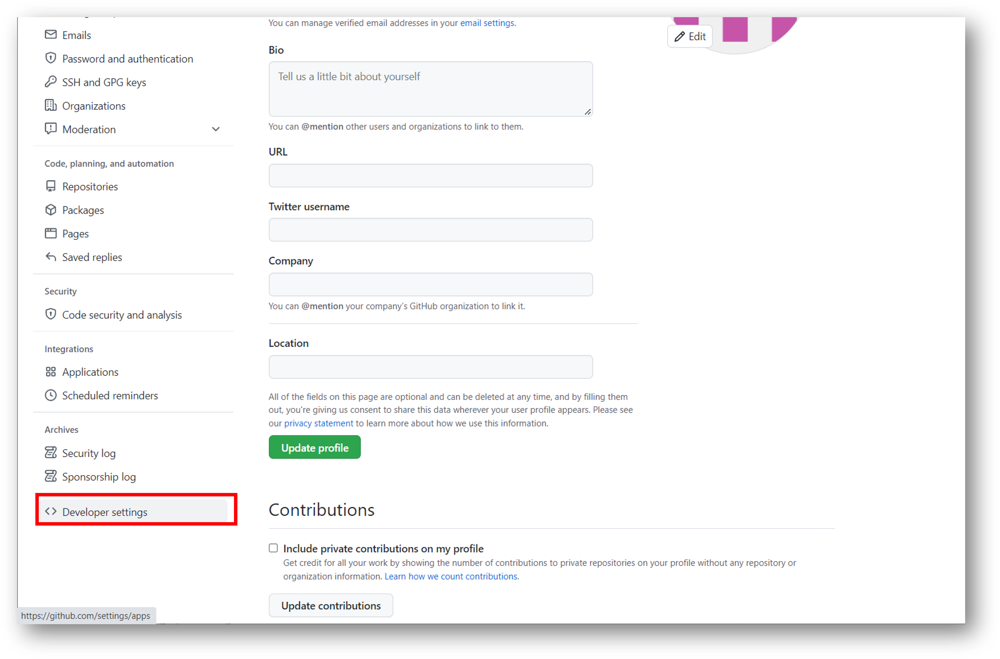    
4.  Select Personal access tokens  
5.  Select Generate new token  
6.  Under Select scopes, select the checkbox for "workflow"  
  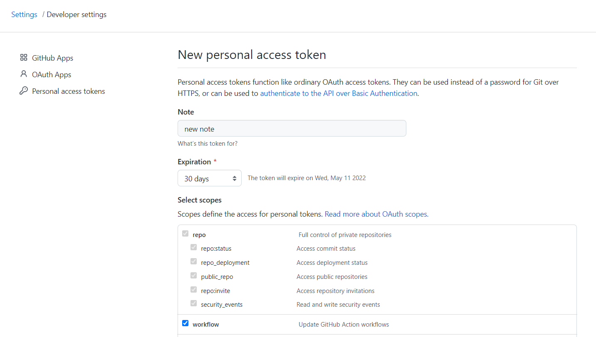  
7. Add your own note  
8. Select Generate token (at bottom of page)  
9.  Copy your newly generated token  
**Note**: *Be sure to save this token for completing pipeline setup, else this token will need to be regenerated*  
  
  For further information refer to https://docs.microsoft.com/en-us/azure/devops/organizations/accounts/use-personal-access-tokens-to-authenticate

## 4. Navigate to and open for editing, templates/parameters.json.example in your local directory
1. Open a local command window  
2. Clone the forked repo locally  
 ```git clone https://github.com/<your-account>/business-process-automation```  
3. Navigate to  your templates/parameters.json.example within your local repo  
```cd business-process-automation/templates```
4. Rename the file to "parameters.json"  
**Note**: *This is an important step to ensure successful deployment*. The file can be renamed via the command line, a local File Explorer browser, or after opening via Visual Studio Code (see the below note)  
4. Open parameters.json
**Note**:*If you have Visual Studio Code installed, you can launch at the current directory by typing "code ."  
```C:\Users\<UserName>\business-process-automation\templates\code .```  
Update the three "value" fields below:  

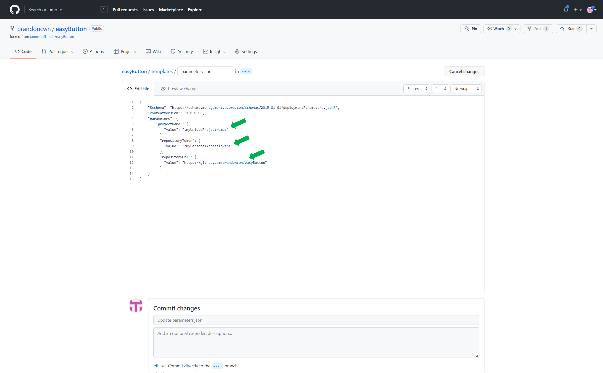  

  1. projectName: Must be a unique project name, keep to lowercase, alphanumeric characters only  
  2. repository token: Copy the personal access token you recently created  
  3. repository url: Paste the link of your forked repository - i.e., https://github.com/<your-account>/business-process-automation  
  
  Save updates
  
## 5. Run initial deployment configuration  
1. In your local repository, navigate to the 'templates' directory  
2. Run  
```az deployment group create --name ExampleDeploymentName --resource-group <YourResourceGroup> --template-file main.json --parameters parameters.json```  
  **Note**: *This may take several minutes to run*  
3. When this has completed you should have the application infrastructure deployed to your resource group.  Navigate to your Resource Group at your Azure Portal confirm to confirm your newly created resources.  
`azure.portal.com`   
  
## 6. Collect the Published Profiles from your newly created Azure Function Apps  
  In this sequence of steps you will retrieve credentials from your two newly created Azure Function Apps, and add them as Secrets in your GitHub repo.  
1.  You will have two new function apps deployed within your Resource Group.  Navigate to your Resource Group at your Azure Portal.  
One will start with the name "huggingface".  
  
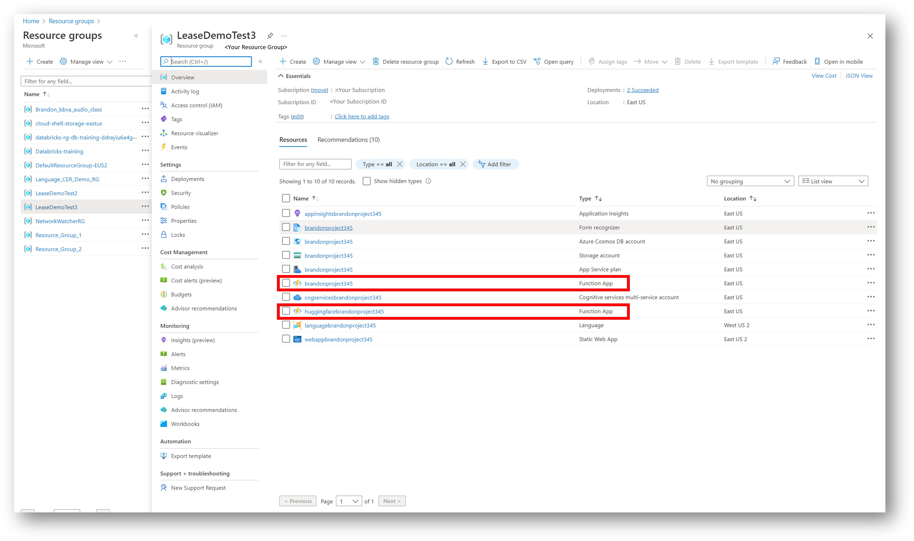  
  
Open the "huggingface" function app and in the "overview" tab there will be a button "Get publish profile" in the top center, which will then download a file. This will download as "[YourProjectName].PublishSettings.txt"  
   
  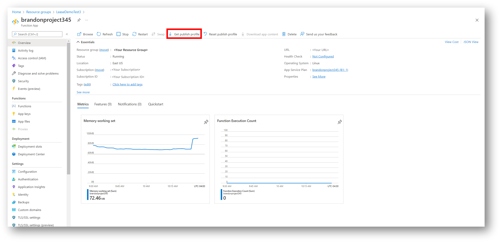  
2. Open the downloaded file, and copy the contents (to be pasted in upcoming steps)  
3. Navigate back to your forked repo, go to Settings (local settings in the middle center) -> Secrets -> Actions  
    
4. Select 'New Repository Secret'  
  - Paste `AZURE_HF_FUNCTIONAPP_PUBLISH_PROFILE` into the "Name" field  
  - Paste the contents of your recently downloaded "[YourProjectName].PublishSettings.txt" file into the "Value" field
5. Repeat Steps 1-4 above the same process for the second newly created Azure Function App within your Resource Group, with the same name as your project name.  
  **Note**: *For step 4 above, this second secret will be named* `AZURE_FUNCTIONAPP_PUBLISH_PROFILE`


## 6. Create Github Action to build the code and deploy it to your Function Apps
1. Navigate to "actions" tab  
2. Select set up workflow yourself
  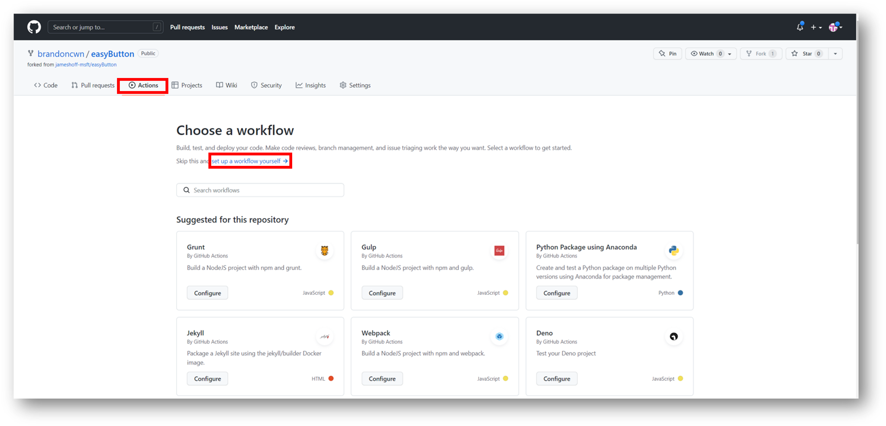
3. This will take you to the editor for the main.yml file. Update the file within the editor by copying the contents of your **local** main.yml file (C:\Users\[UserName]\business-process-automation\templates\main.json) into the body.  
4. Run the workflow and select commit new file  
  **Note**: *Once you've run your workflow once, you'll want to delete previous workflow runs to prevent buildup of old workflows.*  
    - Select "Start Commit"
    - Select "Commit New File"
5. View the progress of your actions under the "Actions" tab.  This can take over 10 minutes to complete. 
  You can also view real-time logs from your Azure Function Apps:
    - Navigate to your Azure Portal, and select your Function APP, named after your project name  
    - Select "Log Stream" in the left navigation pane (towards the bottom; may have to scroll down)
    - Switch the stream from "File System Logs" to "App Insights Logs" via the drop down menu, directly above your log window
 
## 7. Go to your React App!  
1. Navigate to your Resource Group within your Azure Portal
2. Select your static webapp  
3. Within the default Overview pane, Click on your URL, which will take you to your newly launced WebApp!  
 
 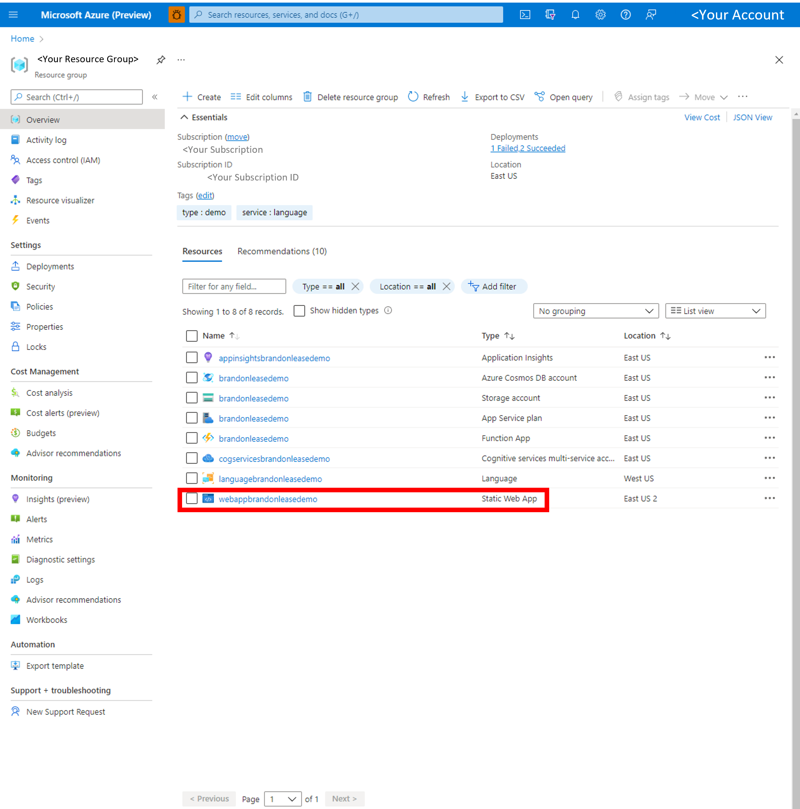
 
## 8. Load Documents!
1. Select Configure a New Pipeline  
  
2. If you have a .pdf file, select "PDF Document". You can also upload WAV files for transcription, and subsequent language processing  
**Note**: *The .pdf input tile can accomodate several image input file format types (including, JPEG, PNG, BMP, TIFF)* More information at https://docs.microsoft.com/en-us/azure/applied-ai-services/form-recognizer/faq  
3. Next, continue building your pipepline by selelecting which analytical service you would like to apply:
    - Depending on your selection, new analytical services will appear. For example, for .pdf files, your first selection can extracting raw tables via the Form Recognizer's General Document Model.  
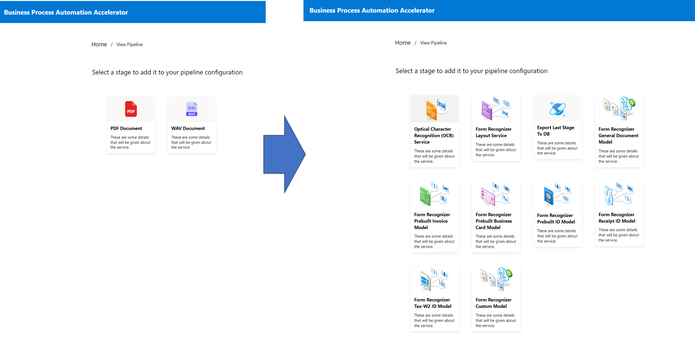  
Alternatively, you can first OCR the raw image to text, by selecting Form Recognizer's OCR Service, after which your app will show new options that are available to you for processing converted text
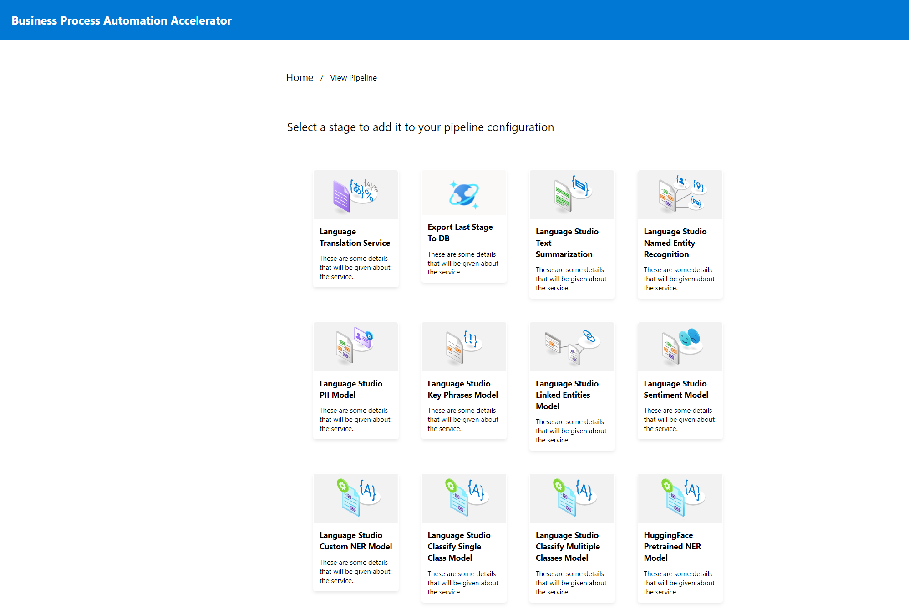  
4. To complete your pipeline, select the tile "Export Last Stage to DB"  
5. Navigate to "Home"  
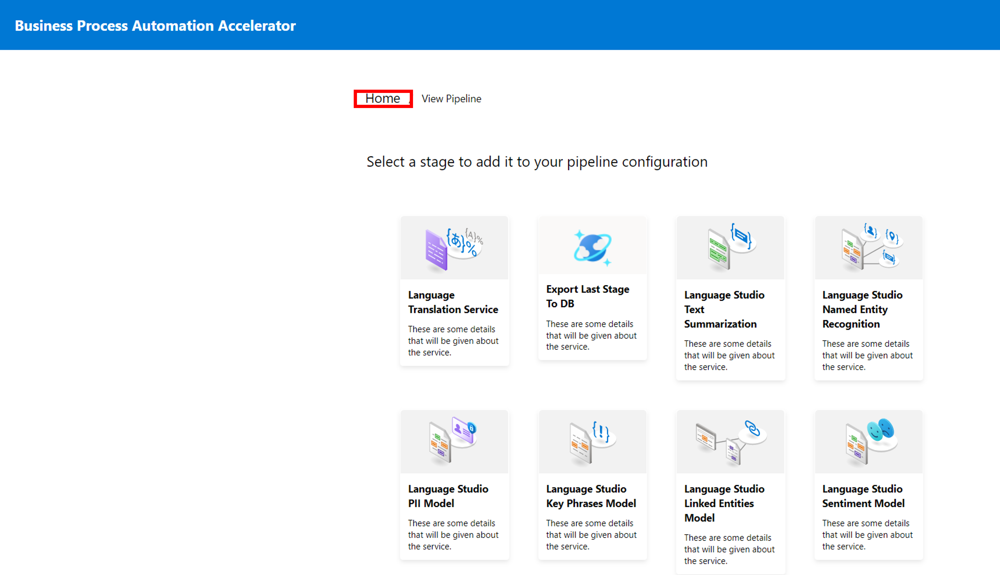  
6. Select "Ingest Documents"
7. Upload your first document! Once your document upload is completed, You'll see a message indicating "Upload Successful". You can upload more than one document at a time here.  
**Note**: *Your documents should be in pdf/image format or .wav format. The first document loaded may take several minutes. However, all subsequent documents should be processed much faster*

  ## 9. View Your Results
  Your results will be stored in a Cosmos database within your Azure Resource Group.  
  - Navigate to your cosmosDB in your Azure Resource Portal (which will also have the same name as your project name)  
  - Navigtate to your Data Explorer  
  - You should see a container, named after your project name. Select that container  
  - You will see a SQL query, named after your project name. Select that query  
  - Within that query, Select Items. Here you should see multiple items  
    - The first item will be your pipeline metadata  
    - The second will be contain the output from your first document  
    - An additional item will be created for each uploaded document  
  
You can further customize your UI via the repo - Simple instructions on how to quickly do so are coming soon

## Contacts
 Please reach out to the AI Rangers for more info or feedback aka.ms/AIRangers

## Roadmap
| Priority | Item |
| ------- | ------------- |
| Impending | Adding instructions on basic UI customizations (e.g. adding header graphics, changing title, etc..) |
| TBD | ... |
 

## References
| Subject | Source (Link) |
| ------- | ------------- |
| React source template | This project was bootstrapped with [Create React App](https://github.com/facebook/create-react-app) |
| Azure Form Recognizer |  https://docs.microsoft.com/en-us/azure/applied-ai-services/form-recognizer/concept-model-overview |
| Azure Language Service | https://docs.microsoft.com/en-us/azure/cognitive-services/language-service/overview |
| HuggingFace | https://huggingface.co/models?pipeline_tag=text-classification&sort=downloads |
| Additional Model Documentation | |
